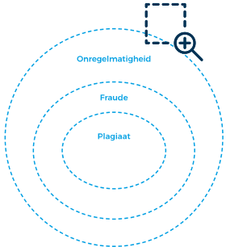
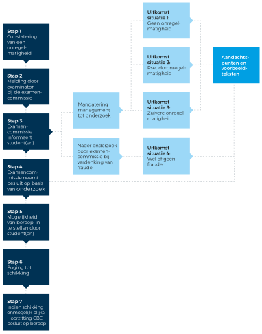

# Handreikingen

## Het onderscheid tussen onregelmatigheid en fraude: handreiking voor examencommissies

### Inleiding
Voor u ligt een praktisch stappenplan dat kan worden gebruikt bij het maken van een onderscheid tussen onregelmatigheden en gevallen van fraude. Eerst zal het begrip ‘onregelmatigheid’ verder worden uitgediept en zal het nut van het maken van een onderscheid tussen onregelmatigheden en fraude worden toegelicht. Daarna wordt beschreven welke bepalingen dienen te worden opgenomen in de reglementen van de onderwijsinstelling, om een onderscheid tussen onregelmatigheden en fraude mogelijk te maken. Vervolgens komt de bevoegdheidsverdeling aan bod: wie neemt welk besluit? Hierna volgt het stappenplan, waarin u wordt meegenomen van het moment van signalering van een mogelijke onregelmatigheid, tot het moment waarop een definitief besluit wordt genomen. Tot slot worden de vier mogelijke besluiten die kunnen worden genomen besproken.  

### Het onderscheid tussen onregelmatigheden en fraude
Het instellingsbestuur is verantwoordelijk voor de praktische organisatie van tentamens. Het is echter de examencommissie die belast is met het borgen van de kwaliteit van tentamens. Dit behelst zowel de integriteit van de tentamens zelf, als de kwaliteit van de organisatie en procedures rondom de tentamens. Binnen het kader van de onderwijs- en examenregeling (OER) stellen het instellingsbestuur en de examencommissie richtlijnen vast omtrent het afleggen en beoordelen van tentamens.3 Ieder handelen of nalaten door een student in strijd met de regels, richtlijnen en aanwijzingen met betrekking tot het afleggen van tentamens kan worden aangemerkt als een onregelmatigheid. Indien een onregelmatigheid het onmogelijk maakt om op juiste wijze een oordeel over de kennis, het inzicht, de vaardigheden of de beroepshouding van een student te vormen dan kan worden gesproken van fraude. Plagiaat is een vorm van fraude. Gevallen van fraude zijn dus een deelverzameling van de categorie ‘onregelmatigheid’.  

{width=50%}

Fraude mag bestraft worden. Studenten kunnen worden uitgesloten van tentamens voor de duur van (maximaal) één studiejaar of zij kunnen zelfs worden verwijderd van de opleiding.5 Indien sprake is van een onregelmatigheid (niet zijnde fraude) dan bestaat deze bestraffingsbevoegdheid niet. Het is dan enkel toegestaan om de situatie terug te draaien naar hoe deze was vóór de overtreding. Met andere woorden: het behaalde resultaat van het tentamen mag ongeldig worden verklaard.  

In de praktijk wordt het verschil tussen de onregelmatigheid en fraude vaak gezien als nutteloze semantiek. Het maken van een duidelijk onderscheid tussen gevallen van onregelmatigheden en gevallen van fraude heeft echter veel voordelen. Indien de relevante regelingen van een onderwijsinstelling hiervoor grondslag bieden, kan immers bij elke onregelmatigheid (te weten: elke overtreding van de regels) in principe het desbetreffende tentamenresultaat ongeldig worden verklaard. Hierbij hoeft niet aannemelijk te worden gemaakt dat het onmogelijk is geworden om zich een juist beeld over de kennis en kunde van de student te vormen. Het inzetten van de ‘onregelmatigheid’ bespaart de examencommissies dus tijd (het nemen van een besluit over een onregelmatigheid behoeft een minder uitgebreid onderzoek dan besluiten over fraude) en kan nodeloze beroepsprocedures voorkomen (het label ‘fraudeur’ is voor veel studenten reden om een besluit aan te vechten). Hier komt bij dat het waarborgen van de integriteit en kwaliteit van de tentamens wordt vergemakkelijkt. Een besluit tot ongeldigverklaring van een resultaat op grond van een onregelmatigheid behoeft een minder zware toets te doorstaan dan een besluit tot ongeldigverklaring op grond van fraude. De bewijslast voor examencommissie is een stuk lichter bij de onregelmatigheid. Dit terwijl het feitelijke resultaat in het kader van bescherming van de integriteit van tentamens - namelijk: het ongeldig verklaren van een resultaat, waarvan niet zeker is of dit resultaat voortvloeit uit fraude - hetzelfde is.  

In onderhavige handreiking wordt het onderscheid tussen onregelmatigheden en fraude aan de hand van een stappenplan verder uiteengezet.  

### Voorafgaand aan het nemen van een besluit: aanpassing reglementen  
Alvorens in de praktijk uitvoering kan worden gegeven aan het onderscheid tussen onregelmatigheden en fraudegevallen dienen de reglementen van de onderwijsinstelling hier grondslag en ruimte voor te bieden.  

Onder reglementen wordt hier verstaan: elk reglement betreffende fraude en onregelmatigheden dat, binnen het kader van het OER, door de examencommissie wordt vastgesteld.6 Het maakt niet uit of de bepalingen in de OER zelf worden opgenomen, in de Regels en Richtlijnen (R&R) van de examencommissie of wellicht in een separaat fraudeprotocol.  

Wat dient in de reglementen te worden opgenomen:  

* Elke overtreding van de regels zoals opgenomen in de OER en/of R&R met betrekking tot het afleggen van tentamens, levert een onregelmatigheid op. 
* Indien een onregelmatigheid wordt vastgesteld, kan de examencommissie het (resultaat van het) tentamen ongeldig verklaren.  
* [Optioneel] De student verliest door de ongeldigverklaring de gebruikte tentamenkans. Indien nodig kan de student een verzoek indienen voor het verkrijgen van een extra tentamenkans.  
* [Optioneel] De bevoegdheid tot het vaststellen van een onregelmatigheid en het ongeldig verklaren van het (resultaat van het) tentamen (op grond van deze onregelmatigheid) wordt door de examencommissie gemandateerd aan [NAAM ORGAAN]. 

### Wie is bevoegd tot het nemen van besluiten bij onregelmatigheden en fraude?  
De Wet op het hoger onderwijs en wetenschappelijk onderzoek (WHW) legt de plicht tot borging van integriteit van tentamens en de (bijbehorende) bevoegdheid tot het ongeldig verklaren van een resultaat, alsmede het opleggen van een aanvullende sanctie wegens fraude (te weten: uitsluiting van tentamens en/of beëindiging van de inschrijving van de opleiding) geheel bij de examencommissie. Dit betekent dat het enkel de examencommissie is die bevoegd is tot het ongeldig verklaren van tentamens en het opleggen van aanvullende sancties.7 Docenten, examinatoren of het bestuur en management zijn hier in beginsel niet toe bevoegd.  

In de praktijk kan het wenselijk zijn dat de examencommissie zich enkel bezig houdt met het beoordelen en sanctioneren van de ‘echte’ fraudegevallen. Het beoordelen van lichtere gevallen van onregelmatigheden kan worden overgelaten aan bijvoorbeeld het opleidingsmanagement. Aangezien het hier gaat om een wettelijke plicht c.q. bevoegdheid van de examencommissie is het belangrijk dat deze bevoegdheid aan het bestuur en management (of ander orgaan) wordt gemandateerd.8 Met het geven van een mandaat krijgt de gemandateerde de bevoegdheid om in naam van het bestuursorgaan (de examencommissie) besluiten te nemen. De examencommissie raakt haar bevoegdheden op dit gebied niet kwijt en blijft dus eindverantwoordelijk.  

Voor het geven van een mandaat is vereist dat (intern) een schriftelijk besluit wordt genomen waarin de bevoegdheid tot het ongeldig verklaren van resultaten bij een geconstateerde onregelmatigheid wordt gemandateerd. Neem tevens in de relevante reglementen op dat deze bevoegdheid is gemandateerd. Tot slot kan in het besluit (genomen door de gemandateerde) worden opgenomen dat het besluit namens de examencommissie wordt genomen.   

In het navolgende stappenplan zal worden aangegeven welke bevoegdheden volledig bij de examencommissie blijven liggen en welke bevoegdheden (al dan niet gedeeltelijk) worden gemandateerd aan het bestuur en management.9  

### Stappenplan: van melding naar besluitvorming 
**Stap 1:**  
Bij het nakijken van een tentamen, bij het surveilleren bij een tentamen of bij het beoordelen van online proctoring beelden constateert een examinator, surveillant of proctor een onregelmatigheid.10  

**Stap 2:**  
De examinator, surveillant of proctor meldt de geconstateerde onregelmatigheid bij de examencommissie of het daartoe (via mandaat) bevoegde orgaan (hierna: ‘gemandateerde’).  

Indien sprake is van een mandaat voert de gemandateerde een snelle beoordeling uit. In deze beoordeling stelt de gemandateerde (voor zo ver mogelijk) vast of sprake is van (lichte) onregelmatigheid of van een (potentieel) fraudegeval.11 De gemandateerde stuurt afschrift van de melding inclusief de beoordeling door naar de examencommissie.  

* Indien - naar oordeel van de gemandateerde – (toch) geen sprake is van enige onregelmatigheid12, of slechts van een lichte onregelmatigheid13, dan zal de behandeling van de melding volledig door de gemandateerde worden afgehandeld. Hiervan wordt afschrift gestuurd aan de examencommissie.  
* Indien – naar oordeel van de gemandateerde – sprake is van een zwaardere onregelmatigheid14, dan zal alleen het onderzoek (zie stap 3) door de gemandateerde worden uitgevoerd. Verslag van de uitkomst van het onderzoek wordt aan de examencommissie overgedragen. De examencommissie neemt vervolgens het uiteindelijke besluit.  
* Indien – naar oordeel van de gemandateerde – sprake is van fraude15, dan zal de melding volledig worden overgedragen aan de examencommissie voor verdere afhandeling.  

**Stap 3:**  
De examencommissie of de gemandateerde bericht de student dat sprake is van een vermoeden van een onregelmatigheid en stelt nader onderzoek in. Onderdeel van dit onderzoek is het horen van de student. Indien de student hierom vraagt, dienen de stukken die ten grondslag liggen aan het besluit, aan de student (al dan niet geanonimiseerd) te worden toegestuurd. Denk hierbij aan plagiaatrapporten of proctoringbeelden.  

**Stap 4:**  
Na afronding van het onderzoek neemt de examencommissie een (schriftelijk gemotiveerd) besluit. Dit besluit wordt aan de student bekend gemaakt.  

**Stap 5:**  
De student heeft zes weken na bekendmaking van het besluit om beroep in te stellen bij het College van Beroep voor de Examens (CBE).16 Beroep wordt ingesteld door indiening van een beroepschrift.   

**Stap 6:**  
Voordat het beroep in behandeling wordt genomen dient tussen de examencommissie en de student een schikkingsgesprek plaats te vinden. De examencommissie bericht het CBE over de uitkomst van dit schikkingsgesprek.  

**Stap 7:**  
Indien partijen geen schikking hebben bereikt, wordt het beroep in behandeling genomen. De examencommissie dient een verweerschrift in. Het CBE plant een hoorzitting. Na afloop van de hoorzitting neemt het CBE een besluit. Dit besluit strekt of tot bevestiging van het besluit van de examencommissie (het beroep is ongegrond) of tot (gedeeltelijke) vernietiging van het besluit van de examencommissie (het beroep is geheel of gedeeltelijk gegrond). Het CBE kan bepalen dat door de examencommissie een nieuw besluit moet worden genomen (met inachtneming van hetgeen is overwogen door het CBE) of dat het tentamen opnieuw dient te worden afgenomen.  

Onderstaand een schematische weergave van het stappenplan (figuur 2): 

### Mogelijke besluiten in stap 4 van het stappenplan 

Nadat een onregelmatigheid is geconstateerd en onderzoek is verricht, is het aan de examencommissie (of aan de gemandateerde) om een besluit te nemen. Er zijn vier mogelijke besluiten die kunnen worden genomen. Hieronder wordt op elke van deze vier mogelijkheden nader ingegaan.  

#### Situatie 1: geen onregelmatigheid  

Er is (toch) geen sprake van een onregelmatigheid (lees: van enige overtreding van de regels, instructies of aanwijzingen). Het onderzoek kan worden gesloten. De student wordt bericht dat geen sprake is van een onregelmatigheid en dat geen verdere stappen worden ondernomen. Tegen dit besluit staat geen beroep open.  

**Bevoegdheidsverdeling**  
Situatie 1 wordt volledig afgehandeld door de gemandateerde. De gemandateerde voert het onderzoek uit en neemt het uiteindelijke besluit. De gemandateerde stuurt afschrift van (de uitkomst van) het onderzoek en het besluit aan de examencommissie.  

**Aandachtspunten**  
Nu het besluit van de examencommissie in situatie 1 niet gericht is op een rechtsgevolg (er wordt immers geen maatregel opgelegd), staat hiertegen geen beroep open.  

#### Situatie 2: de pseudo-onregelmatigheid  
Er is sprake van een onregelmatigheid (lees: van een overtreding van de regels, instructies of aanwijzingen), maar de overtreding maakt niet dat de integriteit van de tentamens in het geding komt.  

*In de voorschriften rondom online tentamens is opgenomen dat eten en drinken tijdens de toets verboden is. Op de proctoring beelden is echter te zien dat de student een (reeds gepelde) banaan eet. De student vertoont geen verdacht gedrag. Op de deskscan is niets anders te zien dan de gepelde banaan. De banaan komt duidelijk in beeld en ook hier is niets verdachts aan te zien.* 

Bij de pseudo-onregelmatigheid is strikt formeel sprake van een overtreding van de regels. Indien (na onderzoek) echter kan worden geconcludeerd dat de integriteit van het tentamen op geen enkele manier in geding is gebracht, is het opleggen van een maatregel niet redelijk c.q. verdedigbaar. In dat geval volstaat het geven van een waarschuwing welke kan worden opgenomen in het dossier van de student. Tegen het besluit staat geen beroep open.  

**Bevoegdheidsverdeling**  
Situatie 2 wordt volledig behandeld door de gemandateerde. De gemandateerde voert het onderzoek uit en neemt het uiteindelijke besluit. De gemandateerde stuurt afschrift van (de uitkomst van) het onderzoek en het besluit aan de examencommissie. 

**Aandachtspunten**  
De omstandigheden van het geval zijn hier van groot belang. Het overtreden van dezelfde regel kan immers onder andere omstandigheden wél de kwaliteit van het tentamen in het geding brengen. Bijvoorbeeld: 

In de voorschriften rondom online tentamens is opgenomen dat eten en drinken tijdens de toets verboden is. Op de proctoring beelden is te zien dat de student een flesje op tafel heeft staan. Een deel van het label van het flesje is niet door de camera vastgelegd. Wel is te zien dat de student meerdere malen een blik op het flesje werpt. 

In dat geval is geen sprake (meer) van een pseudo-onregelmatigheid, maar is situatie 3 van toepassing.  

* Nu het besluit van de examencommissie in situatie 2 niet gericht is op een rechtsgevolg (er wordt immers geen maatregel opgelegd), staat hiertegen geen beroep open. Het geven van een waarschuwing en het opnemen van het bericht in het dossier van de student is geen rechtsgevolg, maar een administratieve handeling.17 
* Nu geen fraude is vastgesteld kan de waarschuwing die wordt gegeven niet worden opgenomen in een frauderegister, simpelweg omdat dit register enkel is bedoeld voor fraudegevallen. De waarschuwing kan wel worden opgenomen in het dossier van de student.  

**Voorbeeldtekst van het besluit:**  

Om de kwaliteit en integriteit van tentamens en examens te borgen heeft de [NAAM ONDERWIJSINSTELLING] regels, voorschriften en instructies vastgesteld. Deze regels, voorschriften en instructies zijn vastgelegd in de Onderwijs- en Examenregeling, [NAAM REGELING, VOORSCHRIFT OF INSTRUCTIE] en ook aan u bekend gemaakt. Onregelmatigheden kunnen leiden tot een ongeldigverklaring van het tentamen en/of aanvullende sancties. De [NAAM GEMANDATEERDE] heeft namens examencommissie heeft vastgesteld dat sprake is van een onregelmatigheid bij het tentamen [NAAM TENTAMEN]. [SPECIFICEREN VAN ONREGELMATIGHEID]. De examencommissie heeft besloten geen maatregel op te leggen. Dit bericht heeft te gelden als waarschuwing.  

#### Situatie 3: de zuivere onregelmatigheid  

Er is sprake van een onregelmatigheid waardoor de integriteit van het tentamen in het geding komt, maar: 

* (i) waarbij de vaststelling van fraude niet mogelijk (of zeer lastig) is.  
* (ii) waarvan de student geen verwijt kan worden gemaakt c.q. wat niet binnen de invloedssfeer ligt van de student. 

De zuivere onregelmatigheid is primair bedoeld voor de ‘fraude-twijfelgevallen’ (i). Hier komt het onderscheid tussen de onregelmatigheid en fraude het meest van pas. Indien een overtreding wordt vastgesteld, maar hierbij is niet zeker of de overtreding ernstig genoeg is om als fraude te kunnen worden aangemerkt, dan kan dit een debat opleveren. Debat over het bewijs (of het ontbreken daarvan), debat over of de onregelmatigheid daadwerkelijk invloed heeft gehad (of heeft kunnen hebben) op het afleggen van het tentamen, etc. Om dit debat te vermijden, en om zeker te zijn dat het besluit in beroep stand zal houden, kan ervoor worden gekozen om ‘enkel’ over te gaan tot ongeldigverklaring. Indien de relevante reglementen hier grond voor geven dan kan in principe elke onregelmatigheid grond geven voor een ongeldigverklaring. Drie voorbeelden van mogelijke twijfelgevallen: 

*Een student kan enkel haar collegekaart tonen, maar niet een legitimatiebewijs. De OER verplicht studenten wel om beide te laten zien. Hierdoor kan de onderwijsinstelling niet checken of de student is wie zij zegt dat zij is.*  

In dit voorbeeld is duidelijk sprake van een overtreding van de regels maar is geen fraude gepleegd. Het vergeten van het identiteitsbewijs (terwijl zij wel haar identiteit kan aantonen met haar collegekaart) maakt het vormen van een juist oordeel over haar kennen en kunnen niet onmogelijk. Toch kan de onderwijsinstelling er belang bij hebben deze regels te handhaven. In dat geval kan het tentamen ongeldig worden verklaard op grond van een onregelmatigheid.18  

*Een surveillant ziet dat een student een telefoon in zijn broekzak heeft zitten. In het fraudeprotocol is opgenomen dat studenten tijdens het afleggen van tentamens geen telefoon binnen handbereik mogen hebben. Geen van de surveillanten heeft verdacht gedrag gezien bij de student, geen van de surveillanten heeft de student de telefoon zien gebruiken.*  

Hier kan de onderwijsinstelling in bewijsnood komen. Op welk moment (voor of na het tentamen) is vastgesteld dat de telefoon in de broekzak zat? Is gekeken of de telefoon aan stond? Heeft de student de telefoon op de wc kunnen gebruiken? Heeft de telefoon van enige invloed kunnen zijn op het afleggen van het tentamen? Om dit debat te vermijden, kan worden gekozen voor de onregelmatigheid in plaats van voor een fraudebeschuldiging.  

*Een student levert een onderzoeksverslag met diverse (zeer) gebrekkige bronverwijzingen. Bij het overnemen van bepaalde passages heeft de student weliswaar een bron vermeld maar ontbreken aanhalingstekens.*  

Onjuiste bronvermeldingen kunnen worden aangemerkt als plagiaat.19 Dit hangt echter wel af van de omstandigheden van het geval. Zijn bronnen verkeerd vermeld in de voetnoten of zijn aanhalingstekens vergeten? Wekken de ontbrekende aanhalingstekens de indruk dat het de eigen tekst is van de student of is af te leiden dat hier wordt geciteerd? Ook hier kan bij twijfel worden gekozen voor de onregelmatigheid in plaats van voor een beschuldiging van plagiaat.   

Situatie ii ziet op de situatie waarbij de regels zijn overtreden, maar waarbij deze overtreding niet aan de student kan worden toegerekend c.q. deze overtreding niet in de invloedssfeer van de student ligt. Situatie ii kan uiteraard enige overlap hebben met situatie i. Twee voorbeelden:

*De camera van een student gaat enkele minuten offline. Na onderzoek blijkt dat het gaat om een storing aan de zijde van de proctoring software, niet aan de zijde van de student.*  

*Drie studenten maken samen een groepsopdracht. In de groepsopdracht worden grote overeenkomsten geconstateerd tussen het werkstuk van de studenten en een werkstuk van studenten uit een voorgaand jaar. Student X geeft toe dat hij plagiaat heeft gepleegd en inderdaad wordt enkel in het door hem geschreven werkstuk plagiaat gevonden. Student Y en student Z hebben geen plagiaat gepleegd. Student X wordt gesanctioneerd wegens het plegen van fraude (plagiaat). Van Studenten Y en Z wordt het resultaat ongeldig verklaard.*  

De examencommissie dient te beoordelen of de integriteit van een tentamen in het geding komt. Als een camera tijdens een gedeelte van het tentamen uitvalt door een storing van de zijde van de onderwijsinstelling, is niet zeker dat de student geen kans tot spieken heeft gehad. Als in een groepsopdracht plagiaat wordt geconstateerd, dan kunnen de studenten die geen plagiaat hebben gepleegd, niet een incomplete opdracht (het stuk zonder plagiaat) inleveren. Hierdoor is het onmogelijk om aan de tentamens een resultaat toe te kennen. De integriteit van de tentamens staat hier onder druk. Om deze reden kunnen de tentamens ongeldig worden verklaard.  

Het is echter niet redelijk c.q. verdedigbaar om de studenten in bovenstaande voorbeelden (aanvullend) te bestraffen. In het eerste voorbeeld is dit niet redelijk nu het niet aan de student te wijten is dat de camera uitviel. In het tweede voorbeeld is dit niet redelijk omdat studenten Y en Z niet degenen waren die plagiaat hebben gepleegd. De uitkomst is dan ook dat het tentamen van de student uit het eerste voorbeeld en de tentamens van de studenten Y en Z uit het tweede voorbeeld ongeldig worden verklaard, maar dat in hun geval geen gebruik wordt gemaakt van de bestraffingsbevoegdheid in artikel 7.12b lid 2 WHW. Geen fraude, wel een onregelmatigheid. Tegen dit besluit staat beroep open.20  

**Aandachtspunten**  

* In situatie 3 is sprake van een reparatoire- c.q. herstelmaatregel.21 De examencommissie maakt bij het opleggen van deze maatregel geen gebruik van de sanctiebevoegdheid zoals vastgelegd in artikel 7.12b lid 2 WHW, maar beschermt enkel de integriteit van het tentamen op grond van artikel 7.12b lid 1 sub a jo lid 3 WHW. Indien een onregelmatigheid wordt vastgesteld welke niet als fraude wordt gekwalificeerd, dan is het niet mogelijk om een aanvullende punitieve-/strafmaatregel op te leggen (denk aan: uitsluiting van tentamens of beëindiging van de inschrijving).  
* Nu geen fraude is vastgesteld kan het besluit dat wordt genomen niet worden opgenomen in een frauderegister, simpelweg omdat dit register enkel is bedoeld voor fraudegevallen. Het besluit kan wel worden opgenomen in het dossier van de student.  
* Verliest de student na ongeldigverklaring van het tentamen een tentamenkans? Hierbij zijn twee mogelijkheden: 
* of de student verliest bij deze optie nooit een tentamenkans, 
* of de student verliest bij deze optie altijd een tentamenkans en kan (indien nodig) bij de examencommissie een verzoek indienen voor een nieuwe kans. 
* Bij optie (ii) kan vervolgens een nader onderscheid worden gemaakt tussen studenten al naar gelang de mate waarin een voorval in hun invloedssfeer valt. Bij de student die te maken krijgt met technische problemen met proctoring software (bovenstaand eerste voorbeeld) zal een verzoek voor een extra tentamenkans worden toegewezen. Bij de studenten van de groepsopdracht (bovenstaand tweede voorbeeld) kan het verzoek worden toegewezen, indien de studenten bijvoorbeeld kunnen aantonen dat zij het stuk voorafgaand aan het inleveren door een plagiaatscanner hebben gehaald (zonder verdachte uitkomst) of als kan worden aangetoond dat ook zij misleid zijn door de plagiërende student. Het staat de examencommissie natuurlijk vrij om ook in situatie (ii) in bijzondere situaties direct bij het besluit een extra tentamenkans toe te kennen zonder dat studenten hiertoe een verzoek moeten indienen. Bijvoorbeeld in het geval dat een grote groep studenten door hetzelfde probleem (welk probleem buiten hun invloedssfeer ligt) worden geraakt. Hiermee wordt ook (onnodige) studievertraging voorkomen. 
* Een onderwijsinstelling komt erachter dat een docent de antwoorden van tentamens heeft laten slingeren. De antwoorden zijn vervolgens op het internet geplaatst. De examencommissie kan niet achterhalen welke studenten de antwoorden wel en welke studenten de antwoorden niet hebben gezien. De examencommissie besluit voor de gehele groep studenten (100+) het tentamen ongeldig te verklaren. Voor alle studenten wordt direct een nieuw tentamen ingepland en wordt een nieuwe kans toegekend.
* Houd er rekening mee dat indien een onregelmatigheid geheel aan de onderwijsinstelling kan worden toegerekend, enige vertraging die de student oploopt door de ongeldigverklaring van een tentamen, aan de onderwijsinstelling kan worden toegerekend. Dit kan resulteren in aansprakelijkheid. Zaak dus om in die gevallen zo snel mogelijk een nieuwe tentamenkans te organiseren of een verzoek voor een extra tentamenkans toe te wijzen.  
* Het ongeldig verklaren van tentamens kan ook plaatsvinden, nadat reeds een diploma is uitgereikt. Als immers vast komt te staan dat de integriteit van een resultaat niet gewaarborgd kan worden, dan kan ook de kwaliteit van het diploma niet worden geborgd. Het behoeft natuurlijk geen betoog dat studenten sneller geneigd zullen zijn om tegen een dergelijk besluit in beroep te gaan. Indien mogelijk dient een besluit tot ongeldigverklaring dan ook te worden genomen vóór uitreiking van het diploma.  

**Voorbeeldtekst van het besluit**  

Om de kwaliteit van tentamens en examens te borgen heeft de [NAAM ONDERWIJSINSTELLING] regels, voorschriften en instructies vastgesteld. Deze regels, voorschriften en instructies zijn vastgelegd in de Onderwijs- en Examenregeling, [NAAM REGELING, VOORSCHRIFT OF INSTRUCTIE] en ook aan u bekend gemaakt. De examencommissie heeft vastgesteld dat sprake is van een onregelmatigheid bij het tentamen [NAAM TENTAMEN]. [SPECIFICEREN VAN ONREGELMATIGHEID]. Nu de integriteit van het tentamen [NAAM TENTAMEN] niet meer kan worden gewaarborgd, zal het resultaat van dit tentamen ongeldig worden verklaard. Dit betekent dat u het tentamen opnieuw zal moeten maken. Voor uw deelname aan het tentamen [NAAM TENTAMEN] wordt één tentamenkans geregistreerd. Indien nodig kunt u bij de examencommissie een verzoek indienen voor het verkrijgen van een extra tentamenkans.  

#### Situatie 4: fraude en plagiaat  
Er is sprake van een onregelmatigheid die wél aan de student te wijten is c.q. die wél in de invloedssfeer van de student ligt en welke het vormen van een juist beeld over de kennis en vaardigheden van de student onmogelijk maakt. Het betreft hier de meer klassieke gevallen van fraude en plagiaat. Het nemen van een besluit tot vaststelling en sanctionering van fraude valt buiten de reikwijdte van dit stappenplan en zal daarom hier niet verder worden besproken.  

### Auteurs
Rolf Bindels, advocaat-partner bij Honoré Advocaten (bindels@honoreadvocaten.nl) 

Jillian van Damme, advocaat bij Honoré Advocaten (vandamme@honoreadvocaten.nl) 

Roelof van Deemter, toetsdeskundige en extern lid, resp. voorzitter van twee examencommissies van de Hogeschool van Amsterdam (rvd@shibboleth.nl) 
